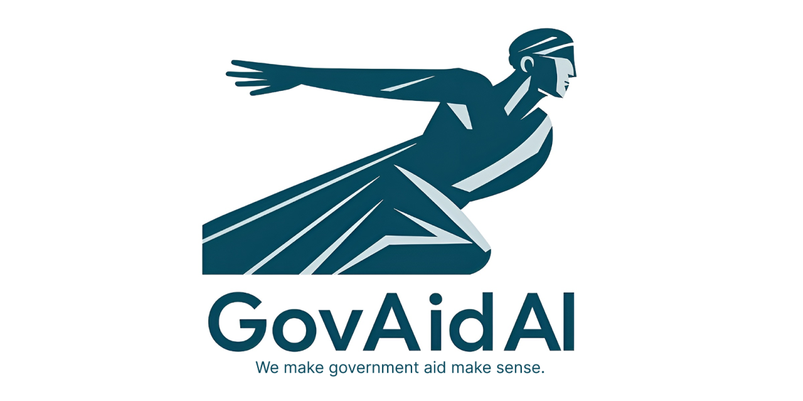

# GovAid AI

---

**This project is a submission for Sonoma Hacks 4.0 (24 Hours Hackathon).**

## Problem Statement
Navigating government aid programs is often confusing, with complex policy documents, eligibility requirements, and legal jargon. Many individuals and organizations struggle to understand what aid is available, how to qualify, and what steps to take, leading to missed opportunities and frustration.

## Solution
GovAid AI is an AI-powered platform designed to make government aid policies accessible and understandable. Users can upload policy documents or provide URLs, and the platform generates plain-language summaries, answers questions, and creates actionable checklists. By leveraging advanced AI and a user-friendly interface, GovAid AI empowers users to make informed decisions and access the support they need.

---

AI-powered platform to help users understand government aid policies with plain-language summaries and intelligent Q&A.

## Features

- **Government Aid Policy Analysis**: Upload PDF/DOCX files or paste government aid policy URLs for AI-powered analysis
- **Plain Language Summaries**: Get easy-to-understand summaries of complex government aid policy documents
- **Interactive Q&A**: Ask questions about government aid policies and get intelligent responses
- **Checklist Generation**: Automatically generate actionable eligibility checklists from government aid policy documents

## Tech Stack

- **Frontend**: React 18, TypeScript, Vite
- **UI Components**: Radix UI, Tailwind CSS, shadcn/ui
- **AI Integration**: OpenRouter API (Claude 3 Haiku)
- **Routing**: React Router DOM
- **State Management**: TanStack Query
- **Forms**: React Hook Form with Zod validation

## Getting Started

### Prerequisites

- Node.js 18+ 
- npm or yarn

### Installation

1. Clone the repository:
```bash
git clone <your-repo-url>
cd GovAid-AI
```

2. Install dependencies:
```bash
npm install
```

3. Set up environment variables:
Create a `.env` file in the root directory:
```env
VITE_OPENAI_API_KEY=your_openai_api_key_here
```

4. Start the development server:
```bash
npm run dev
```

The application will be available at `http://localhost:8080`

## Available Scripts

- `npm run dev` - Start development server
- `npm run build` - Build for production
- `npm run preview` - Preview production build
- `npm run lint` - Run ESLint

## Project Structure

```
src/
├── components/          # Reusable UI components
│   ├── ui/             # Base UI components (shadcn/ui)
│   └── ui-custom/      # Custom components
├── pages/              # Page components
├── hooks/              # Custom React hooks
├── lib/                # Utility functions and configurations
└── App.tsx             # Main application component
```

## License

This project is licensed under the MIT License - see the LICENSE file for details.
